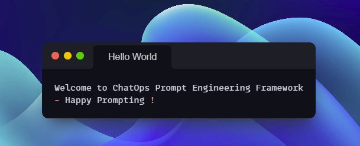
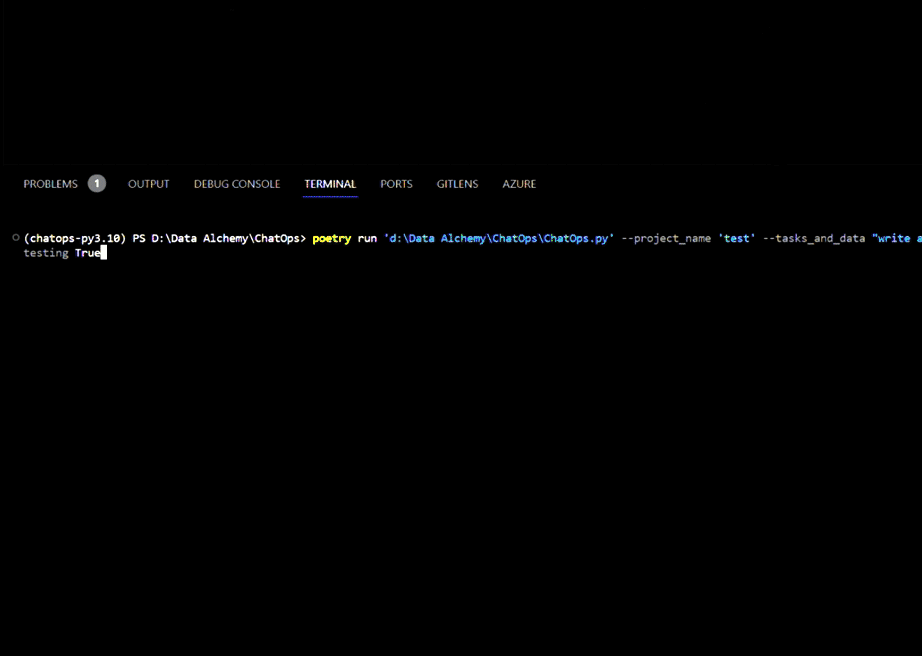
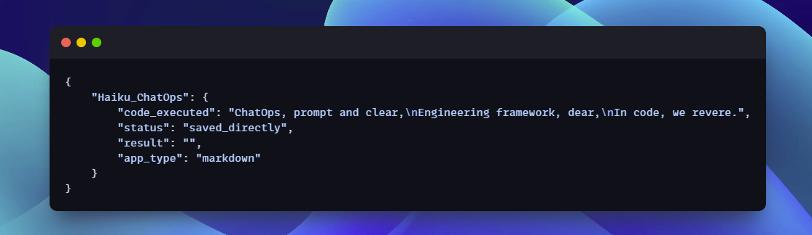
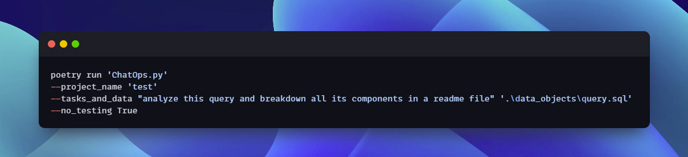
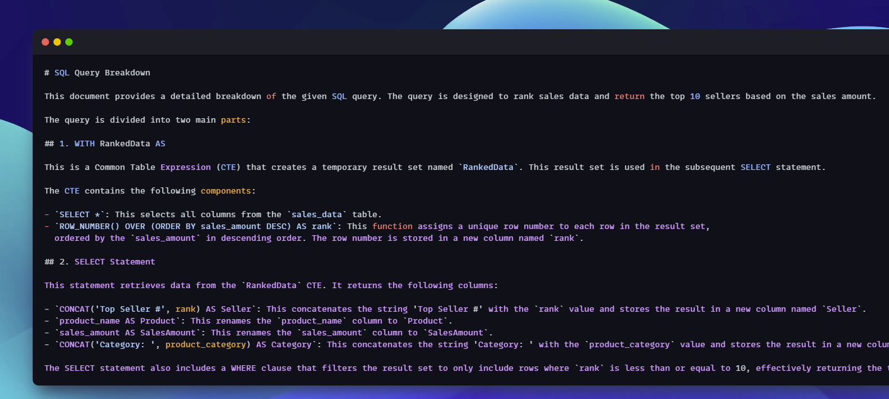
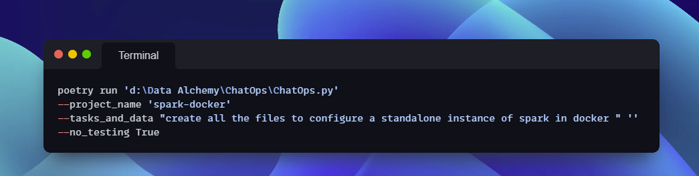
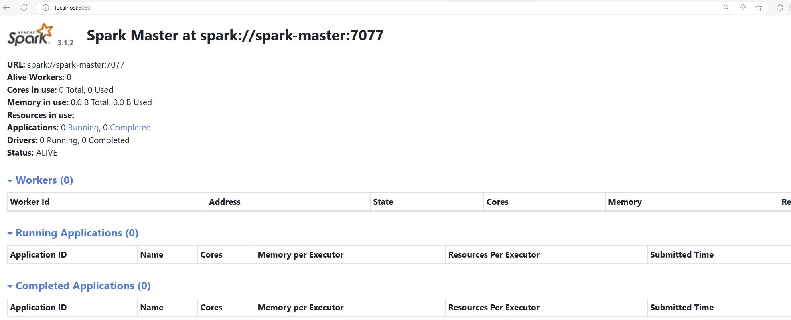

```
 ______     __  __     ______     ______   ______     ______   ______    
/\  ___\   /\ \_\ \   /\  __ \   /\__  _\ /\  __ \   /\  == \ /\  ___\   
\ \ \____  \ \  __ \  \ \  __ \  \/_/\ \/ \ \ \/\ \  \ \  _-/ \ \___  \  
 \ \_____\  \ \_\ \_\  \ \_\ \_\    \ \_\  \ \_____\  \ \_\    \/\_____\ 
  \/_____/   \/_/\/_/   \/_/\/_/     \/_/   \/_____/   \/_/     \/_____/ 
```                                                                        

# ChatOps: Prompt Engineering Framework



The ChatOps CLI was built to simplify the prompt engineering process. With ChatOps cli you can streamline the development lifecycle, providing an efficient workflow for planning, coding, testing, and deploying code using LLMs. ChatOps can run and tests your code after llm generation to make sure it is functional.

With ChatOps you will be able to:
   - Create and reuse chat chains 🔗 to build executable workflows and combine them with non llm code execution
   - Run code in real time and build self healing code 🩹. Your chains can be configured to repair code and react to errors.
   - Configure chains to evalutate your processes and act as a quality tester.
   - Quickly iterate by building templates and passing your data as arguments or files. 

## Table of Contents

- [Setup](#setup)
- [Usage](#usage)
- [Contributing](#contributing)
- [Plan Function](#plan-function)
- [Sample Usage](#sample-usage)
- [Enhancements](#enhancements)
- [Links](#links)

## Setup

**Important:** 
<details>
  <summary><strong>Usage Note:</strong></summary>
  **It is highly recommended to setup this tool inside a docker container to seperate the code generated by ChatGpt from your system. This will be added as a built in option later on**
</details>

To set up the ChatOps framework, follow these steps:

1. Clone the repository:

   ```bash
   git clone https://github.com/Data-Alchemy/ChatOps.git
   ```
2. Navigate to the project directory:
    ```bash
    cd chatops
    ```
3. Install Poetry
Poetry is a dependency management and packaging tool for Python. This tool uses poetry to manage dependencies and run the application.
   [More information on Poetry](https://python-poetry.org/)
   #### macOS / Linux

   ```
   curl -sSL https://install.python-poetry.org | python3 - 
   ```

   #### Windows (Powershell)
   ```
   (Invoke-WebRequest -Uri https://install.python-poetry.org -UseBasicParsing).Content | py -
   ```

4. Install Dependencies
    ```bash
    poetry install
    ```
4. Set up environment variables

    To configure the ChatOps credentials create a `llm.env` file in the project env folder and add the necessary environment variables. These variables are essential for connecting to the Azure OpenAI API and defining other configurations.

    ```dotenv
    # llm.env
    ```
   Configure credentials for azure open ai auth under the `./env/llm.env` file [Microsoft How To Documentation](https://learn.microsoft.com/en-us/azure/ai-services/openai/quickstart?tabs=command-line&pivots=programming-language-python)


    | Variable                    | Value                     | Explanation                          |
    |-----------------------------|--------------------------|---------------------------------------|
    | AZURE_OPENAI_KEY            | your_openai_key          | OpenAI API key for authentication.    |
    | AZURE_OPENAI_ENDPOINT       | your_openai_endpoint     | Endpoint URL for the OpenAI API.      |
    | AZURE_OPENAI_API_VERSION    | your_openai_api_version  | API version of the OpenAI service.    |
    | AZURE_OPENAI_API_TYPE       | your_openai_api_type     | Type of the OpenAI API being used.    |
    | SUPPORT_EMAIL               | support@example.com      | Email address for support.            |
    | MODEL_NAME                  | your_model_name          | Name of the specific model to use.    |


# Usage


> Here is some basic information about using ChatOps cli

## Key Terms in ChatOps

| Term                | Description                                    |
|---------------------|------------------------------------------------------|
| Chat Chains         | Sequential exchanges of messages in a conversational context, forming a chain of communication between ai roles. |
| Prompt Roles        | Assigned roles with specific responsibilities in a collaborative content generation framework, guiding individuals in their contribution tasks. |
| Chat Chain Planning | The strategic and organized process of planning and structuring conversational interactions within a chat system, often to achieve specific communication goals. |
| Shared Context Windows | Common reference points or informational frames that are accessible to multiple participants in a conversation, ensuring a consistent understanding of the context. |
| ChatFrames | The data structures that store the output of prompts |

## ChatFrames

>ChatFrames are the main in memory data structures of a chat chain. This is how chains share data between chat instances. All in memory operations happen with ChatFrames up until writting to disk.



### Components

- **Key**: The name of the ChatFrame, representing a unique identifier for the execution. Becomes the file name when output

- **code_executed**: The actual code snippet or content generated by a model.

- **status**: Indicates the status of the execution. 
   
   Possible values include:
   - "saved_directly": Code saved directly without execution.
   - "completed": Successful code execution.
   - "failed": Code execution encountered an error.

- **result**: Holds the output or result of the code execution.

- **app_type**: Denotes the type of application used for running the code. For example, "markdown" indicates that the code is written in Markdown.

 


Run the ChatOps cli using the main script ` poetry run ChatOps.py`. Here are the available command-line options:

## Arguments

| Argument            | Type      | Default   | Description                                                                                                 |
|---------------------|-----------|-----------|-------------------------------------------------------------------------------------------------------------|
| `--project_name`    | String    | "bot"     | The name of your project. It will be used to store the output of the prompt. (Optional, defaults to "bot")  |
| `--objective_name`  | String    | -         | Your AI assistant's objective description.                                                                 |
| `--tasks_and_data`  | List      | []        | Pairs of task and data values. Example: `--tasks_and_data 'Task1' 'Data1' 'Task2'  'Data2'` Data can be provided directly for simple inputs or as a file path which will read the file and pass it into the chat context for the specific task.                 |
| `--output_index`    | String    | None      | Index of the output to process. If not provided, processes the last output by default.                      |
| `--overwrite_project`| Boolean  | False     | Flag to indicate whether to overwrite the project.                                                         |
| `--data_file`       | String    | None      | Path to a file containing data values. When using this parameter, data file will be available globally to all tasks|
| `--no_testing`      | Boolean   | False     | If set to true, will output results from LLM without trying to execute the code.                           |
| `--output_override` | List      | [None, None] | When passed, can override LLM file output rules and specify file name and application. Both must be passed together. Application is used for running code; passing 'python' will execute code as a Python script. Example: `--output_override 'hello_world.py' 'python'`.

## Samples
   - Example 1 : Analyze a query
   
   
    
   

   - Example 2: Create Docker Container for Spark

   
   

# Contributing

Contributions are welcome! To contribute to the ChatOps framework, follow these steps:

1. Fork the repository.
2. Create a new branch for your feature or bug fix.
3. Make your changes and commit them.
4. Push the changes to your fork.
5. Create a pull request to the main repository.


# Upcoming Features

| Feature                              | Description                                                                                                                                                 |
|--------------------------------------|-------------------------------------------------------------------------------------------------------------------------------------------------------------|
| **RAG**                                   | Will Add RAG using Chroma DB                                 |
| **Run inside Docker**                | Ensures better security by allowing the ChatOps Large Language Model (LLM) Automation Framework to run inside Docker containers.                                 |
| **Streamlit Front End**              | Introduces a streamlined user interface using Streamlit, a Python library to enhance the overall user experience.   |
| **API Mode for Task Management**     | - **Overview:** Introduce API-based triggering for tasks, providing a programmatic way to interact with and control the ChatOps framework.                              - **Key Benefits:** Enables automation, flexibility in task management, and seamless integration with other tools and systems.                                - **Implementation:** Integrates APIs, documents endpoints, implements security measures, and ensures scalability for future expansions.|

<div style="animation: colorChange 5s infinite, size 5s infinite;">Happy Prompting !</div>

<style>
@keyframes colorChange {
    0% { color: #40E0D0; }
    50% { color-color: blue; }
    100% { color-color: green; }
}
@keyframes size {
    0% { transform: scale(1); }
    50% { transform: scale(1.1); }
    100% { transform: scale(1); }
}
</style>
